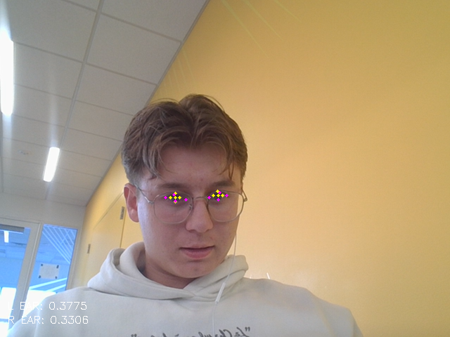

<div align="center">


<br/><br/>

# MouseEye

**Control your mouse cursor with your eyes — hands-free.**

Move the cursor by looking around. Blink your left eye to left-click, blink your right eye to right-click.

[](https://www.python.org/)
[](https://mediapipe.dev/)
[](https://opencv.org/)
[](https://pyautogui.readthedocs.io/)
[](LICENSE)
[](https://github.com/Davide-Bonn/MouseEye/stargazers)

---

</div>

## Overview

MouseEye uses MediaPipe's **Face Mesh** with the 478-point model (including refined iris landmarks) to track your eye movements in real time. Your iris position controls the cursor, and blinks trigger mouse clicks.

<div align="center">


<sub>Preview window — cyan dots track iris position, magenta dots measure eye openness, EAR values shown at bottom.</sub>
</div>

---

## How It Works

```
┌────────┐    ┌───────────┐    ┌──────────────┐    ┌────────────────┐
│ Webcam │ ─► │ Face Mesh │ ─► │ Iris Center  │ ─► │ Cursor moveTo  │
│ Frame  │    │ 478 pts   │    │ landmarks    │    │ (pyautogui)    │
└────────┘    └───────────┘    ├──────────────┤    ├────────────────┤
                               │ Eye Aspect   │ ─► │ click() or     │
                               │ Ratio (EAR)  │    │ click(right)   │
                               └──────────────┘    └────────────────┘
```

| Step | Detail |
|------|--------|
| **Iris Tracking** | The right iris center (landmarks 468–472) is mapped to screen coordinates to move the cursor |
| **Blink Detection** | Eye Aspect Ratio (EAR) measures the vertical-to-horizontal ratio of each eye. When EAR drops below a threshold, the eye is considered closed |
| **Left Click** | Close your **left eye** only (keep right eye open) |
| **Right Click** | Close your **right eye** only (keep left eye open) |
| **Smoothing** | Cursor movement is smoothed with interpolation to prevent jitter |
| **Cooldown** | A 15-frame cooldown prevents repeated clicks from a single blink |

---

## Quick Start

### Prerequisites

- [Python](https://www.python.org/) 3.8+
- A webcam

### 1. Clone and install

```bash
git clone https://github.com/Davide-Bonn/MouseEye.git
cd MouseEye
pip install -r requirements.txt
```

### 2. Run

```bash
python mouse_eye.py
```

Press **`q`** to quit.

---

## Configuration

Tune these constants at the top of `mouse_eye.py`:

| Variable | Default | Description |
|----------|---------|-------------|
| `SMOOTHING` | `4` | Higher = smoother but slower cursor. Lower = more responsive but jittery |
| `BLINK_THRESHOLD` | `0.004` | EAR value below which an eye is considered closed. Lower = harder to trigger |
| `CLICK_COOLDOWN` | `15` | Frames to wait between clicks. Prevents double-clicks from slow blinks |
| `CAM_INDEX` | `0` | Webcam device index. Change if you have multiple cameras |

---

## Preview Window

The preview window shows:

- **Cyan dots** — Iris landmarks (tracking cursor position)
- **Magenta dots** — Eye corner landmarks (measuring blink ratio)
- **L EAR / R EAR** — Live Eye Aspect Ratio values for each eye
- **LEFT CLICK / RIGHT CLICK** — Flash indicator when a click is triggered

---

## Key Landmarks

```
Right Eye                          Left Eye
  159 (top)                          386 (top)
   |                                  |
33 ---- 133                      263 ---- 362
   |                                  |
  145 (bottom)                       374 (bottom)

Right Iris: 468-472              Left Iris: 473-477
```

---

## Dependencies

| Package | Purpose |
|---------|---------|
| `mediapipe` | Face Mesh model with 478-point detection and iris refinement |
| `opencv-contrib-python` | Webcam capture, frame processing, preview window |
| `pyautogui` | Mouse cursor movement and click simulation |
| `numpy` | Distance calculations for Eye Aspect Ratio |

---

## Project Structure

```
MouseEye/
├── assets/
│   └── mouseeye.png     # Preview window screenshot
├── mouse_eye.py         # Main script — iris tracking + blink detection
├── logo.svg             # Project logo (512x512)
├── icon.svg             # App icon (128x128)
├── requirements.txt
├── LICENSE
└── README.md
```

---

## Troubleshooting

| Issue | Fix |
|-------|-----|
| Cursor drifts or jumps | Increase `SMOOTHING` to `6` or `8` |
| Clicks trigger too easily | Lower `BLINK_THRESHOLD` to `0.003` |
| Clicks don't register | Raise `BLINK_THRESHOLD` to `0.005` |
| Double clicks on single blink | Increase `CLICK_COOLDOWN` to `25` |
| Wrong webcam selected | Change `CAM_INDEX` to `1` or `2` |

---

## Related

| Project | Description |
|---------|-------------|
| [**Recognition Using MediaPipe**](https://github.com/Davide-Bonn/Recognition-Using-Mediapipe) | Hand tracking, face detection, pose estimation, and eye mesh demos |

---

## License

[MIT License](LICENSE) — see LICENSE for details.
